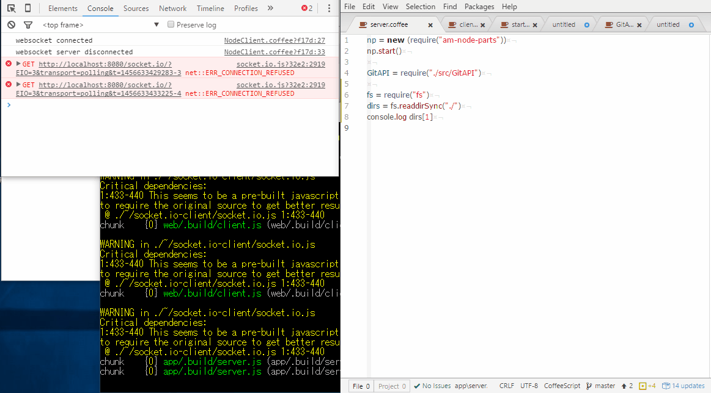

# まだ工事中

出来ること
coffeescriptを用い
* nodeモジュールの開発・テスト
* browserモジュールの開発・テスト
* electronアプリケーションモジュールの開発・テスト

実装したいリスト
* Rust開発のための土台
  * rustコンパイラにも依存させる？うまくmodule切り分け出来るかも？
* Bot開発のための土台
  * commandライン入力をelectron上で仮想的に実装
* IoT開発のための土台
  * ssh接続＋自動FTP送信あたり？


# amdev?
* AM development environment
* 午前の開発環境



#この環境で開発したモジュールの一覧
https://github.com/ampcpmgp/amdev/tree/master/modules


## this project environment
```
git clone github.com/ampcpmgp/amdev
npm i
npm start
```

### Recommended development environment
* 2 display (1920x1080 * 2) adove

### author's software environment

```
# bash user
python2 nvm node yarn
# windows user - install chocolatey
choco install -yf --allow-empty-checksums nodist lhaplus notepadplusplus googlechrome firefox crystaldiskinfo greenshot crystaldiskmark gitkraken libreoffice googlechrome.canarcy win32diskimager.install virtualbox slack autoit winmerge atom screentogif githubforwindows wechat visualstudio2015community
# download
TODO: cliborを含んだ開発環境を作る
clover - http://www.vector.co.jp/download/file/winnt/util/fh608107.html 3.2は不安定　( choco install clover )
color picker - http://www.vector.co.jp/soft/dl/win95/art/se350616.html
gapdebug - ios debug

# atom package
apm install pigments highlight-selected editorconfig linter script atom-terminal file-icons atom-beautify linter-eslint linter-ui-default linter-js-standard standard-formatter markdown-preview-enhanced docblockr linter-coffee-variables svg-preview restart-atom busy-signal intentions atom-mermaid@2.2.1 language-riot-tag sort-lines

# windows config environment
* 拡張子を表示する
* Ctrl+Alt+上下による画面回転を無効にする（デスクトップ上で右クリック→グラフィックスオプション→ホットキー無効）
